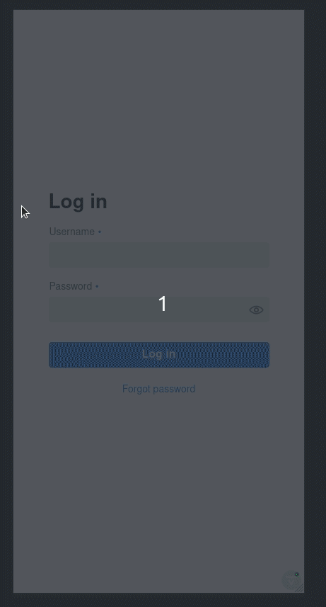
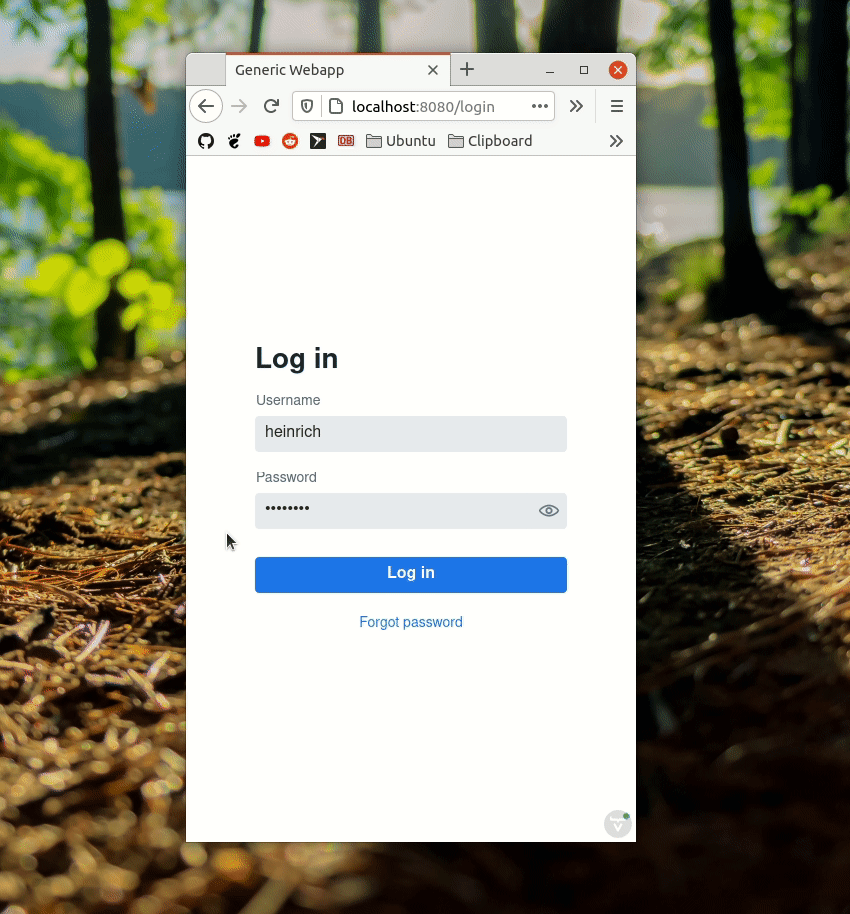
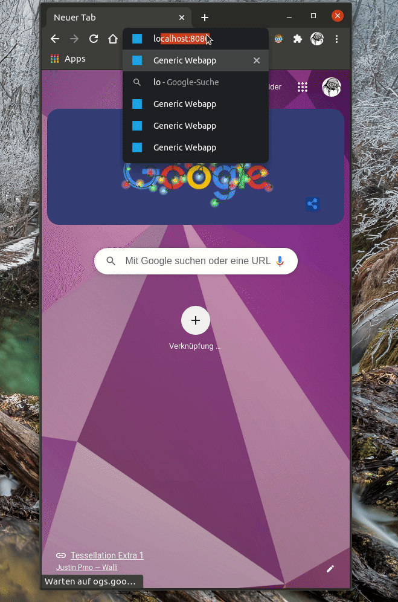
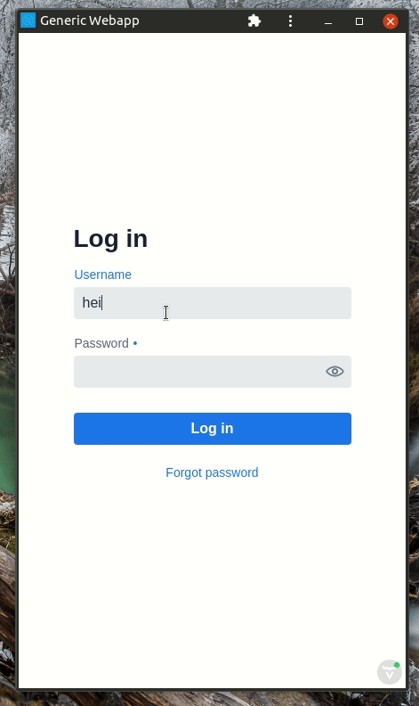
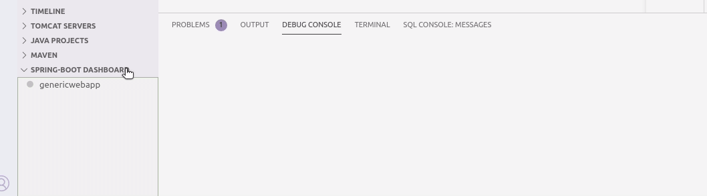

# genericwebapp

TODO:

- [ ] use current github action to deploy the container with mariadb, node, java, maven, and genericwebapp on cloud XYZ
- [X] make vaadins `@PWA` work
- [X] make parts of the gridviews re-usable via abstract class and/or interface
- [X] use proper CSS theming
- [X] add responsive padding

## About

This is a mobile ready, responsive, persistent, generic webapp built with [Spring Boot](https://github.com/spring-projects/spring-boot) and [Vaadin](https://github.com/vaadin/) which can also be installed as a progressive webapp (PWA) directly from within your browsers (currently Firefox desktop does not support PWAs fully yet).

## Use case

This webapp is needs to be extended for individual use cases. It provides a basic user, permission and role management.

New views/tabs can be added either into the existing notebook in `AppView.java` or somewhere else.

The login is secured via Spring Security.

An insecure REST Api exists in the `restapi` maven project.

## Build

1. Install java
   * Windows/MacOs: https://adoptopenjdk.net/
   * Ubuntu: `sudo apt install default-jdk`
2. Install maven
   * Windows/MacOs: https://maven.apache.org/download.cgi
   * Ubuntu: `sudo apt install maven`
3. Install nodejs
   * Windows/MacOs: https://nodejs.org/en/
   * Ubuntu: `sudo snap install node --classic`
4. Install vscode
   * Windows/MacOs: https://code.visualstudio.com/
   * Ubuntu: `sudo snap install code --classic`
5. Install the vscode java extension pack: https://marketplace.visualstudio.com/items?itemName=vscjava.vscode-java-pack
6. Install the vscode spring boot extension pack: https://marketplace.visualstudio.com/items?itemName=Pivotal.vscode-boot-dev-pack
7. Setup a local database and database user ([Tutorial](https://github.com/hs-duesseldorf/se2rest#2-database))
8. Change `application.properties` to match your database/user/password
9. Install git
   * Windows: https://git-scm.com/download
   * MacOs: `brew install git`
   * Ubuntu: `sudo apt install git`
10. clone this repository with `git clone https://github.com/Feichtmeier/genericwebapp`
11. start your local database
12. Open your local clone of the repository with vscode and press the play button in the spring-boot dashboard
    
13. Navigate to `localhost:8080` in your browser to access the webapp
